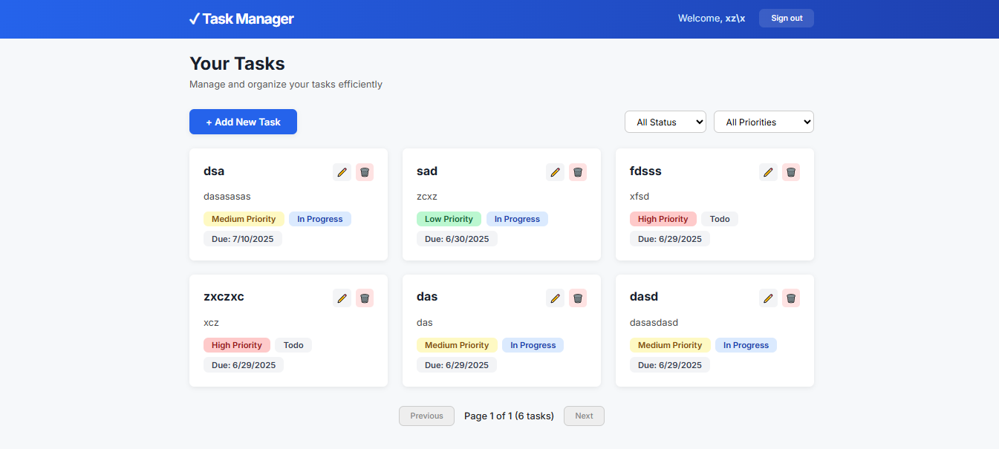

# MERN + Next.js Task Manager

A modern, full-stack task management application built with Next.js (App Router), MongoDB, and plain CSS. Features user authentication, CRUD for tasks, and a clean, responsive UI.


## Project Screenshot




## test user

username: testuser
email: testuser323@gmail.com
password: test232$$


---

## Features
- **User Authentication** (Register/Login/Logout)
- **Task Management** (Create, Read, Update, Delete)
- **Filter Tasks** by status and priority
- **Responsive UI** (works on desktop and mobile)
- **No CSS framework** (uses modern plain CSS)

---

## Getting Started

### 1. Clone the repository
```bash
git clone <your-repo-url>
cd mern-stack
```

### 2. Install dependencies
```bash
npm install
```

### 3. Set up environment variables
Create a `.env` file in the project root:
```
MONGODB_URI=mongodb://localhost:27017/task-manager
NEXTAUTH_URL=http://localhost:3000
NEXTAUTH_SECRET=your-secret-key-here
```

### 4. Start MongoDB
Make sure MongoDB is running locally or update the URI for your cloud database.

### 5. Run the development server
```bash
npm run dev
```

Visit [http://localhost:3000](http://localhost:3000) in your browser.

---

## Project Structure
```
mern-stack/
  src/
    app/
      api/           # Next.js API routes (auth, tasks)
      components/    # React components
      globals.css    # Global CSS (no Tailwind)
      layout.tsx     # App layout
      page.tsx       # Home page (redirects)
      tasks/         # Tasks page
    models/          # Mongoose models (User, Task)
    lib/             # Database connection
```

---

## Usage
- **Register** a new account
- **Login** to your account
- **Add, edit, delete, and filter tasks**
- **Logout** when done

---

## Customization
- Update styles in `src/app/globals.css` or add your own CSS modules
- Change MongoDB URI or NextAuth settings in `.env`

---

## License
MIT
